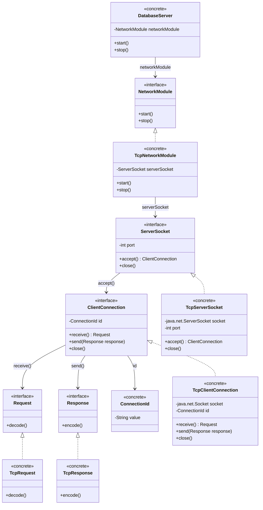

```mermaid
classDiagram
    direction TB

    class DatabaseServer {
        <<concrete>>
        -NetworkModule networkModule
        +start()
        +stop()
    }

    class NetworkModule {
        <<interface>>
        +start()
        +stop()
    }

    class ServerSocket {
        <<interface>>
        -int port
        +accept() ClientConnection
        +close()
    }

    class ClientConnection {
        <<interface>>
        -ConnectionId id
        +receive() Request
        +send(Response response)
        +close()
    }

    class Request {
        <<interface>>
        +decode()
    }

    class Response {
        <<interface>>
        +encode()
    }

    class ConnectionId {
        <<concrete>>
        -String value
    }

    class TcpNetworkModule {
        <<concrete>>
        -ServerSocket serverSocket
        +start()
        +stop()
    }

    class TcpServerSocket {
        <<concrete>>
        -java.net.ServerSocket socket
        -int port
        +accept() ClientConnection
        +close()
    }

    class TcpClientConnection {
        <<concrete>>
        -java.net.Socket socket
        -ConnectionId id
        +receive() Request
        +send(Response response)
        +close()
    }

    class TcpRequest {
        <<concrete>>
        +decode()
    }

    class TcpResponse {
        <<concrete>>
        +encode()
    }

    DatabaseServer --> NetworkModule : networkModule
    NetworkModule <|.. TcpNetworkModule
    ServerSocket <|.. TcpServerSocket
    ClientConnection <|.. TcpClientConnection
    Request <|.. TcpRequest
    Response <|.. TcpResponse

    TcpNetworkModule --> ServerSocket : serverSocket
    ServerSocket --> ClientConnection : accept()
    ClientConnection --> ConnectionId : id
    ClientConnection --> Request : receive()
    ClientConnection --> Response : send()
```
