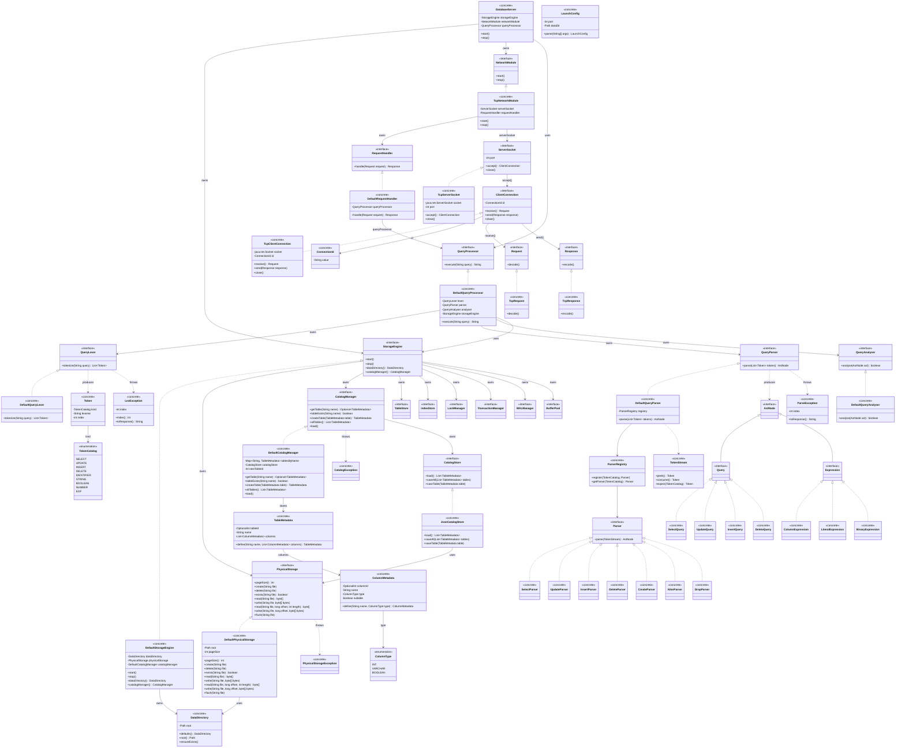

```mermaid
classDiagram
    direction TB

    class DatabaseServer {
        <<concrete>>
        -StorageEngine storageEngine
        -NetworkModule networkModule
        -QueryProcessor queryProcessor
        +start()
        +stop()
    }

    class NetworkModule {
        <<interface>>
        +start()
        +stop()
    }

    class RequestHandler {
        <<interface>>
        +handle(Request request) Response
    }

    class DefaultRequestHandler {
        <<concrete>>
        -QueryProcessor queryProcessor
        +handle(Request request) Response
    }

    class QueryProcessor {
        <<interface>>
        +execute(String query) String
    }

    class DefaultQueryProcessor {
        <<concrete>>
        -QueryLexer lexer
        -QueryParser parser
        -QueryAnalyser analyser
        -StorageEngine storageEngine
        +execute(String query) String
    }

    class QueryAnalyser {
        <<interface>>
        +analyse(AstNode ast) boolean
    }

    class DefaultQueryAnalyser {
        <<concrete>>
        +analyse(AstNode ast) boolean
    }

    class StorageEngine {
        <<interface>>
        +start()
        +stop()
        +dataDirectory() DataDirectory
        +catalogManager() CatalogManager
    }

    class DefaultStorageEngine {
        <<concrete>>
        -DataDirectory dataDirectory
        -PhysicalStorage physicalStorage
        -DefaultCatalogManager catalogManager
        +start()
        +stop()
        +dataDirectory() DataDirectory
        +catalogManager() CatalogManager
    }

    class DataDirectory {
        <<concrete>>
        -Path root
        +defaults() DataDirectory
        +root() Path
        +ensureExists()
    }

    class PhysicalStorage {
        <<interface>>
        +pageSize() int
        +create(String file)
        +delete(String file)
        +exists(String file) boolean
        +read(String file) byte[]
        +write(String file, byte[] bytes)
        +read(String file, long offset, int length) byte[]
        +write(String file, long offset, byte[] bytes)
        +flush(String file)
    }

    class DefaultPhysicalStorage {
        <<concrete>>
        -Path root
        -int pageSize
        +pageSize() int
        +create(String file)
        +delete(String file)
        +exists(String file) boolean
        +read(String file) byte[]
        +write(String file, byte[] bytes)
        +read(String file, long offset, int length) byte[]
        +write(String file, long offset, byte[] bytes)
        +flush(String file)
    }

    class PhysicalStorageException {
        <<concrete>>
    }

    class CatalogManager {
        <<interface>>
        +getTable(String name) Optional~TableMetadata~
        +tableExists(String name) boolean
        +createTable(TableMetadata table) TableMetadata
        +allTables() List~TableMetadata~
        +load()
    }

    class DefaultCatalogManager {
        <<concrete>>
        -Map~String, TableMetadata~ tablesByName
        -CatalogStore catalogStore
        -int nextTableId
        +getTable(String name) Optional~TableMetadata~
        +tableExists(String name) boolean
        +createTable(TableMetadata table) TableMetadata
        +allTables() List~TableMetadata~
        +load()
    }

    class TableMetadata {
        <<concrete>>
        -OptionalInt tableId
        -String name
        -List~ColumnMetadata~ columns
        +define(String name, List~ColumnMetadata~ columns) TableMetadata
    }

    class ColumnMetadata {
        <<concrete>>
        -OptionalInt columnId
        -String name
        -ColumnType type
        -boolean nullable
        +define(String name, ColumnType type) ColumnMetadata
    }

    class ColumnType {
        <<enumeration>>
        INT
        VARCHAR
        BOOLEAN
    }

    class CatalogException {
        <<concrete>>
    }

    class CatalogStore {
        <<interface>>
        +load() List~TableMetadata~
        +saveAll(List~TableMetadata~ tables)
        +saveTable(TableMetadata table)
    }

    class JsonCatalogStore {
        <<concrete>>
        +load() List~TableMetadata~
        +saveAll(List~TableMetadata~ tables)
        +saveTable(TableMetadata table)
    }

    class TableStore {
        <<interface>>
    }

    class IndexStore {
        <<interface>>
    }

    class LockManager {
        <<interface>>
    }

    class TransactionManager {
        <<interface>>
    }

    class WALManager {
        <<interface>>
    }

    class BufferPool {
        <<interface>>
    }

    class LaunchConfig {
        <<concrete>>
        -int port
        -Path dataDir
        +parse(String[] args) LaunchConfig
    }

    class QueryLexer {
        <<interface>>
        +tokenize(String query) List~Token~
    }

    class DefaultQueryLexer {
        <<concrete>>
        +tokenize(String query) List~Token~
    }

    class LexException {
        <<concrete>>
        -int index
        +index() int
        +toResponse() String
    }

    class TokenCatalog {
        <<enumeration>>
        SELECT
        UPDATE
        INSERT
        DELETE
        IDENTIFIER
        STRING
        BOOLEAN
        NUMBER
        EOF
    }

    class Token {
        <<concrete>>
        -TokenCatalog kind
        -String lexeme
        -int index
    }

    class QueryParser {
        <<interface>>
        +parse(List~Token~ tokens) AstNode
    }

    class DefaultQueryParser {
        <<concrete>>
        -ParserRegistry registry
        +parse(List~Token~ tokens) AstNode
    }

    class ParserRegistry {
        <<concrete>>
        +register(TokenCatalog, Parser)
        +getParser(TokenCatalog) Parser
    }

    class Parser {
        <<interface>>
        +parse(TokenStream) AstNode
    }

    class SelectParser {
        <<concrete>>
    }

    class UpdateParser {
        <<concrete>>
    }

    class InsertParser {
        <<concrete>>
    }

    class DeleteParser {
        <<concrete>>
    }

    class CreateParser {
        <<concrete>>
    }

    class AlterParser {
        <<concrete>>
    }

    class DropParser {
        <<concrete>>
    }

    class TokenStream {
        <<concrete>>
        +peek() Token
        +consume() Token
        +expect(TokenCatalog) Token
    }

    class ParseException {
        <<concrete>>
        -int index
        +toResponse() String
    }

    class AstNode {
        <<interface>>
    }

    class Query {
        <<interface>>
    }

    class SelectQuery {
        <<concrete>>
    }

    class UpdateQuery {
        <<concrete>>
    }

    class InsertQuery {
        <<concrete>>
    }

    class DeleteQuery {
        <<concrete>>
    }

    class Expression {
        <<interface>>
    }

    class ColumnExpression {
        <<concrete>>
    }

    class LiteralExpression {
        <<concrete>>
    }

    class BinaryExpression {
        <<concrete>>
    }

    class ServerSocket {
        <<interface>>
        -int port
        +accept() ClientConnection
        +close()
    }

    class ClientConnection {
        <<interface>>
        -ConnectionId id
        +receive() Request
        +send(Response response)
        +close()
    }

    class Request {
        <<interface>>
        +decode()
    }

    class Response {
        <<interface>>
        +encode()
    }

    class ConnectionId {
        <<concrete>>
        -String value
    }

    class TcpNetworkModule {
        <<concrete>>
        -ServerSocket serverSocket
        -RequestHandler requestHandler
        +start()
        +stop()
    }

    class TcpServerSocket {
        <<concrete>>
        -java.net.ServerSocket socket
        -int port
        +accept() ClientConnection
        +close()
    }

    class TcpClientConnection {
        <<concrete>>
        -java.net.Socket socket
        -ConnectionId id
        +receive() Request
        +send(Response response)
        +close()
    }

    class TcpRequest {
        <<concrete>>
        +decode()
    }

    class TcpResponse {
        <<concrete>>
        +encode()
    }

    DatabaseServer --> StorageEngine : owns
    DatabaseServer --> NetworkModule : owns
    DatabaseServer --> QueryProcessor : uses

    NetworkModule <|.. TcpNetworkModule
    RequestHandler <|.. DefaultRequestHandler
    QueryProcessor <|.. DefaultQueryProcessor
    StorageEngine <|.. DefaultStorageEngine
    DefaultStorageEngine --> DataDirectory : owns
    StorageEngine --> PhysicalStorage : owns
    PhysicalStorage <|.. DefaultPhysicalStorage
    DefaultPhysicalStorage --> DataDirectory : uses
    PhysicalStorage ..> PhysicalStorageException : throws
    StorageEngine --> CatalogManager : owns
    CatalogManager <|.. DefaultCatalogManager
    DefaultCatalogManager --> TableMetadata : stores
    TableMetadata --> ColumnMetadata : columns
    ColumnMetadata --> ColumnType : type
    CatalogManager ..> CatalogException : throws
    CatalogManager --> CatalogStore : owns
    CatalogStore <|.. JsonCatalogStore
    JsonCatalogStore --> PhysicalStorage : uses
    QueryLexer <|.. DefaultQueryLexer
    QueryLexer ..> Token : produces
    QueryLexer ..> LexException : throws
    QueryParser <|.. DefaultQueryParser
    Parser <|.. SelectParser
    Parser <|.. UpdateParser
    Parser <|.. InsertParser
    Parser <|.. DeleteParser
    Parser <|.. CreateParser
    Parser <|.. AlterParser
    Parser <|.. DropParser

    TcpNetworkModule --> RequestHandler : owns
    DefaultRequestHandler --> QueryProcessor : queryProcessor
    DefaultQueryProcessor --> QueryLexer : owns
    DefaultQueryProcessor --> QueryParser : owns
    DefaultQueryProcessor --> QueryAnalyser : owns
    DefaultQueryProcessor --> StorageEngine : uses
    QueryAnalyser <|.. DefaultQueryAnalyser
    StorageEngine --> TableStore : owns
    StorageEngine --> IndexStore : owns
    StorageEngine --> LockManager : owns
    StorageEngine --> TransactionManager : owns
    StorageEngine --> WALManager : owns
    StorageEngine --> BufferPool : owns
    DefaultQueryParser --> ParserRegistry
    ParserRegistry --> Parser
    DefaultQueryParser ..> TokenStream
    QueryParser ..> AstNode : produces
    QueryParser ..> ParseException : throws
    AstNode <|-- Query
    Query <|.. SelectQuery
    Query <|.. UpdateQuery
    Query <|.. InsertQuery
    Query <|.. DeleteQuery
    AstNode <|-- Expression
    Expression <|.. ColumnExpression
    Expression <|.. LiteralExpression
    Expression <|.. BinaryExpression
    Token --> TokenCatalog : kind

    ServerSocket <|.. TcpServerSocket
    ClientConnection <|.. TcpClientConnection
    Request <|.. TcpRequest
    Response <|.. TcpResponse

    TcpNetworkModule --> ServerSocket : serverSocket
    ServerSocket --> ClientConnection : accept()
    ClientConnection --> ConnectionId : id
    ClientConnection --> Request : receive()
    ClientConnection --> Response : send()
```
