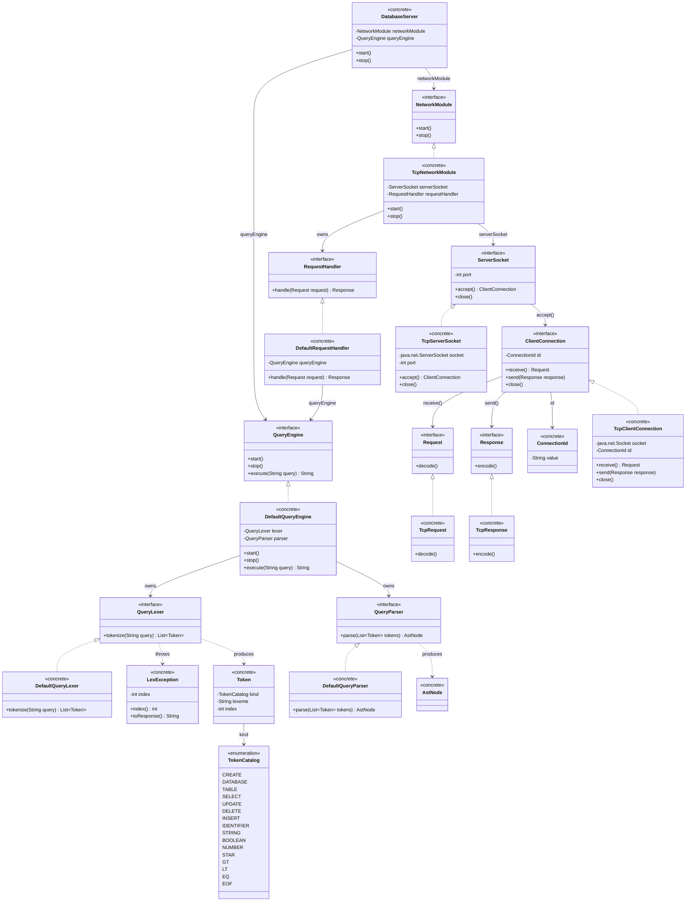

```mermaid
classDiagram
    direction TB

    class DatabaseServer {
        <<concrete>>
        -NetworkModule networkModule
        -QueryEngine queryEngine
        +start()
        +stop()
    }

    class NetworkModule {
        <<interface>>
        +start()
        +stop()
    }

    class RequestHandler {
        <<interface>>
        +handle(Request request) Response
    }

    class DefaultRequestHandler {
        <<concrete>>
        -QueryEngine queryEngine
        +handle(Request request) Response
    }

    class QueryEngine {
        <<interface>>
        +start()
        +stop()
        +execute(String query) String
    }

    class DefaultQueryEngine {
        <<concrete>>
        -QueryLexer lexer
        -QueryParser parser
        +start()
        +stop()
        +execute(String query) String
    }

    class QueryLexer {
        <<interface>>
        +tokenize(String query) List~Token~
    }

    class DefaultQueryLexer {
        <<concrete>>
        +tokenize(String query) List~Token~
    }

    class LexException {
        <<concrete>>
        -int index
        +index() int
        +toResponse() String
    }

    class TokenCatalog {
        <<enumeration>>
        CREATE
        DATABASE
        TABLE
        SELECT
        UPDATE
        DELETE
        INSERT
        IDENTIFIER
        STRING
        BOOLEAN
        NUMBER
        STAR
        GT
        LT
        EQ
        EOF
    }

    class Token {
        <<concrete>>
        -TokenCatalog kind
        -String lexeme
        -int index
    }

    class QueryParser {
        <<interface>>
        +parse(List~Token~ tokens) AstNode
    }

    class DefaultQueryParser {
        <<concrete>>
        +parse(List~Token~ tokens) AstNode
    }

    class AstNode {
        <<concrete>>
    }

    class ServerSocket {
        <<interface>>
        -int port
        +accept() ClientConnection
        +close()
    }

    class ClientConnection {
        <<interface>>
        -ConnectionId id
        +receive() Request
        +send(Response response)
        +close()
    }

    class Request {
        <<interface>>
        +decode()
    }

    class Response {
        <<interface>>
        +encode()
    }

    class ConnectionId {
        <<concrete>>
        -String value
    }

    class TcpNetworkModule {
        <<concrete>>
        -ServerSocket serverSocket
        -RequestHandler requestHandler
        +start()
        +stop()
    }

    class TcpServerSocket {
        <<concrete>>
        -java.net.ServerSocket socket
        -int port
        +accept() ClientConnection
        +close()
    }

    class TcpClientConnection {
        <<concrete>>
        -java.net.Socket socket
        -ConnectionId id
        +receive() Request
        +send(Response response)
        +close()
    }

    class TcpRequest {
        <<concrete>>
        +decode()
    }

    class TcpResponse {
        <<concrete>>
        +encode()
    }

    DatabaseServer --> NetworkModule : networkModule
    DatabaseServer --> QueryEngine : queryEngine

    NetworkModule <|.. TcpNetworkModule
    RequestHandler <|.. DefaultRequestHandler
    QueryEngine <|.. DefaultQueryEngine
    QueryLexer <|.. DefaultQueryLexer
    QueryParser <|.. DefaultQueryParser

    TcpNetworkModule --> RequestHandler : owns
    DefaultRequestHandler --> QueryEngine : queryEngine
    DefaultQueryEngine --> QueryLexer : owns
    DefaultQueryEngine --> QueryParser : owns
    QueryLexer ..> Token : produces
    QueryLexer ..> LexException : throws
    QueryParser ..> AstNode : produces
    Token --> TokenCatalog : kind

    ServerSocket <|.. TcpServerSocket
    ClientConnection <|.. TcpClientConnection
    Request <|.. TcpRequest
    Response <|.. TcpResponse

    TcpNetworkModule --> ServerSocket : serverSocket
    ServerSocket --> ClientConnection : accept()
    ClientConnection --> ConnectionId : id
    ClientConnection --> Request : receive()
    ClientConnection --> Response : send()
```
