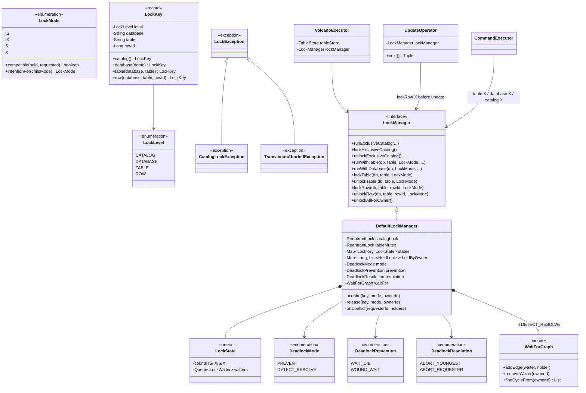
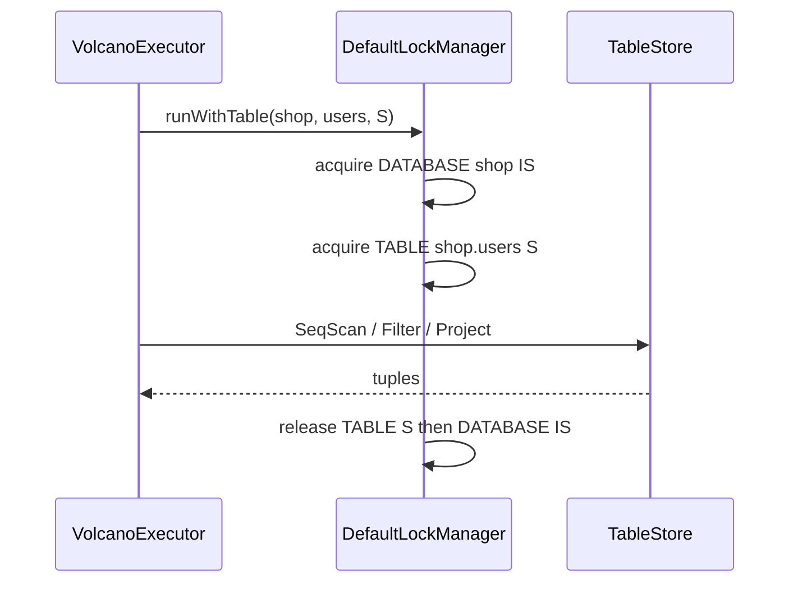
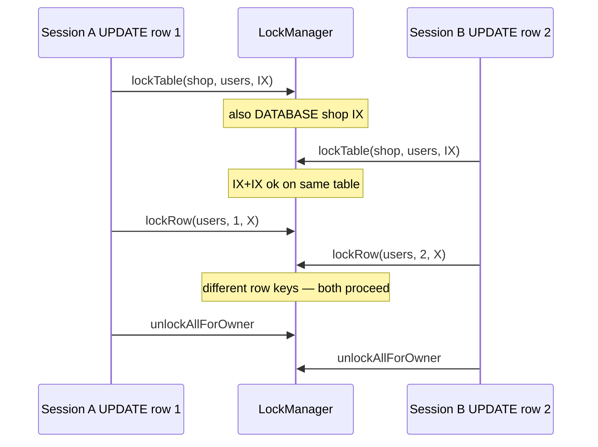
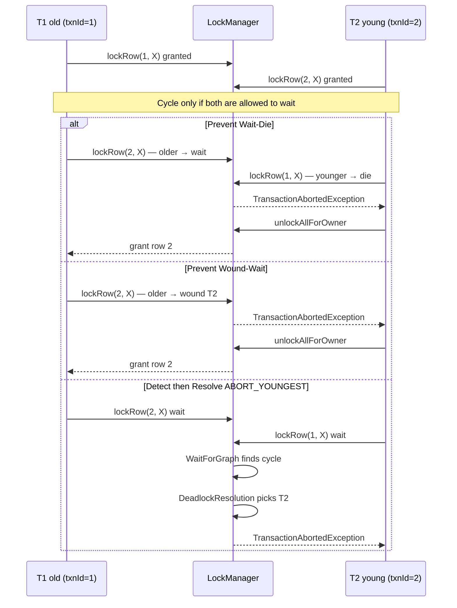
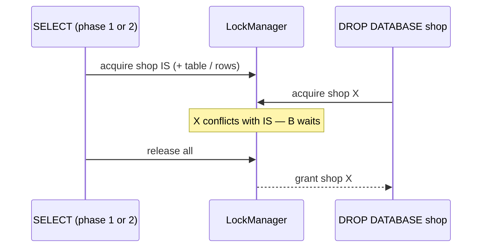

# Scoped locks — implementation (table → row)

How to build scoped locks from `Lock-scopes.md` in **two coding phases**:

1. **Table + database** — table S/X, database IS/IX/X  
2. **Row** — row X (and row S on read), table IS/IX under row locks; deadlock **prevention** (Wait-Die / Wound-Wait) or **detect + resolve** (wait-for graph + victim policy)  

Not BufferPool latches. Not “`BEGIN` takes nothing / hold until COMMIT” (`docs/todo` step 7) — that is a separate duration change; row locks still release at end of auto-commit statement in phase 2, then stick until COMMIT once step 7 lands.

Related: `Lock-scopes.md` (what), `docs/implementations/lock-timing.md` (when), `docs/todo` steps 3 + concurrency row/deadlock.

---

## Two phases (do not ship row before table)

| Phase | Scopes | What becomes possible |
|-------|--------|------------------------|
| **1 — Table** | db IS/IX/X + table S/X | `SELECT users` ∥ `SELECT users`; `SELECT users` ∥ `CREATE orders`; writers exclusive per table |
| **2 — Row** | + row S/X; table mode for DML is **IS/IX** not S/X | `UPDATE id=1` ∥ `UPDATE id=2`; `SELECT` row 1 ∥ `UPDATE` row 2 |

Phase 1 alone: one writer per table. Phase 2: writers on different rows of the same table can run together. DDL (`DROP TABLE`) still takes **table X**, which waits for every IS/IX on that table.

---

## Phase 1 slice (table / database)

| Do in phase 1 | Leave for phase 2 / later |
|---------------|---------------------------|
| `LockManager` names **database** and **table** | **Row** keys, `lockRow`, deadlock prevention / detect+resolve |
| Auto-commit `SELECT` → db IS + table **S**; write DML → db IX + table **X** | Switch writes to table **IX** + row X; reads to table **IS** + row S |
| Table DDL → db IX + table X | — |
| `DROP DATABASE` → database X | — |
| `CHECKPOINT` / `CREATE DATABASE` keep **catalog X** | `BEGIN` empty; hold until COMMIT |

`CREATE DATABASE shop` has no tables yet; catalog X still serializes name creation with CHECKPOINT. `DROP DATABASE shop` must use **database X** or it cannot wait for `SELECT shop.users`.

---

## New types (`storage.lock`) — both phases

Public, small, no SQL / catalog / WAL imports.

| Type | Kind | Role |
|------|------|------|
| `LockMode` | enum | `IS`, `IX`, `S`, `X` |
| `LockLevel` | enum | `CATALOG`, `DATABASE`, `TABLE`, **`ROW`** (phase 2) |
| `LockKey` | record | Names one object. Factories only. |
| `LockException` | exception | Timeout / interrupt. Processor catches this. |
| `TransactionAbortedException` | exception | Victim of prevention die/wound or of resolution after detect (extends `LockException`). |
| `DeadlockMode` | enum | `PREVENT` \| `DETECT_RESOLVE` |
| `DeadlockPrevention` | enum | `WAIT_DIE` \| `WOUND_WAIT` (only with `PREVENT`) |
| `DeadlockResolution` | enum | `ABORT_YOUNGEST` \| `ABORT_REQUESTER` (only with `DETECT_RESOLVE` — **not** “detect cycle”) |

```text
LockKey
  catalog()                          → (CATALOG, —, —, —)
  database(shop)                     → (DATABASE, shop, —, —)
  table(shop, users)                 → (TABLE, shop, users, —)
  row(shop, users, rowId)            → (ROW, shop, users, rowId)   // phase 2
```

`rowId` is the same `long` as `Tuple.rowId()` / `TableStore` heap id — not a primary-key column value.

`LockMode.compatible(held, requested)` is the matrix. Intention is a mode on a **parent** key.

`CatalogLockException` stays for catalog-only messages; make it extend `LockException` (drop `final`).

**Not public** (inside `DefaultLockManager`):

| Internal | Role |
|----------|------|
| `LockState` | Per-key granted counts (IS/IX/S/X) + waiter queue |
| `LockWaiter` | owner id + requested mode + `Condition` |
| `WaitForGraph` | only if `DETECT_RESOLVE`: edges waiter → holder; cycle found → hand to `DeadlockResolution` |

Java `ReentrantReadWriteLock` cannot express IS vs X. One mutex (a **latch** on the lock table) plus this map.

**Owner id + age:** do not key waits only by `Thread`. Prefer `txnId` from `TransactionManager` (monotonic = timestamp for Wait-Die / Wound-Wait). Phase 1 can use `threadId()` until Volcano passes `currentTxnId()`. Same owner reentering the same key+mode increments a count. Lower `txnId` = older txn.

---

## Compatibility (unchanged across phases)

```text
        IS    IX     S     X
IS      yes   yes   yes    no
IX      yes   yes    no    no
S       yes    no   yes    no
X        no    no    no    no
```

Why phase 2 cannot keep **table S** for `SELECT` if writers use **table IX**:

- S + IX = **no** → a full-table shared lock blocks every row writer.
- So phase 2 `SELECT` uses **table IS** + **row S** (per row read), not table S.
- Phase 1 `SELECT` uses **table S** (no row keys yet) — correct until phase 2.

DDL `DROP TABLE` / `ALTER` keep **table X** → conflicts with IS and IX → waits for scanners and row writers.

---

## New methods

### `LockMode`

```text
boolean compatible(LockMode held, LockMode requested)
LockMode intentionFor(LockMode childMode)    // S → IS, X → IX
```

### `LockManager` — phase 1

Keep all four catalog methods.

```text
<T> T  runWithTable(String database, String table, LockMode tableMode, Supplier<T> action)
void   runWithTable(String database, String table, LockMode tableMode, Runnable action)

<T> T  runWithDatabase(String database, LockMode mode, Supplier<T> action)
void   runWithDatabase(String database, LockMode mode, Runnable action)
```

Phase 1: `tableMode` is only **S** or **X**. Manager takes parent intention:

```text
runWithTable(shop, users, S):
  acquire database(shop) IS
  acquire table(shop, users) S
  try action finally release table, then database

runWithTable(shop, users, X):
  acquire database(shop) IX
  acquire table(shop, users) X
  ...
```

**Acquire order:** database → table (→ row in phase 2). **Release:** reverse. Timeout: same `catalogLockWait`. Throw `LockException`.

### `LockManager` — phase 2 additions

`runWith*` alone is not enough: one `UPDATE` touches many rows. Need acquire/release pairs that **stack** under an already-held table intention.

```text
void lockTable(String database, String table, LockMode tableMode)
void unlockTable(String database, String table, LockMode tableMode)

void lockRow(String database, String table, long rowId, LockMode mode)   // mode S or X
void unlockRow(String database, String table, long rowId, LockMode mode)

void unlockAllForOwner()    // statement end / ROLLBACK / disconnect — drop every key this owner holds
```

`lockTable(..., IS)` also acquires `database` IS; `lockTable(..., IX)` acquires database IX (same parent rule as `runWithTable`).  
`lockRow` **requires** the caller already holds table IS (for row S) or table IX (for row X) — assert or auto-take; prefer **assert** so acquire order stays obvious in operators.

Phase 1 can implement `runWithTable` only; phase 2 adds `lock*` / `unlock*` and reimplements `runWithTable` as lock + try + unlockAll (or unlock pair).

Optional sugar:

```text
<T> T runWithRow(String db, String table, long rowId, LockMode mode, Supplier<T> action)
```

Useful in tests; Volcano will use the pair API inside the operator loop.

### `DefaultLockManager` — fields / private methods

```text
-catalogLock: ReentrantLock          // CHECKPOINT / CREATE DATABASE / short persist
-tableMutex: ReentrantLock           // latch for the map
-states: Map<LockKey, LockState>
-heldByOwner: Map<Long, List<HeldLock>>   // for unlockAllForOwner
-mode: DeadlockMode                       // default PREVENT
-prevention: DeadlockPrevention           // default WAIT_DIE
-resolution: DeadlockResolution           // used only if DETECT_RESOLVE
-waitFor: WaitForGraph                    // only DETECT_RESOLVE
-abortFlags: Map<Long, AtomicBoolean>     // WOUND_WAIT / resolve preemption

acquire(key, mode, ownerId)
release(key, mode, ownerId)
grantIfCompatible(state, mode)
onConflict(requesterId, holders)          // prevent or detect; resolve only after cycle
```

Keep `catalogLock` as today’s `ReentrantLock` until optional cleanup maps it to `LockKey.catalog()` + X.

---

## Statement map by phase

| Statement | Phase 1 | Phase 2 |
|-----------|---------|---------|
| `SELECT … FROM shop.users` | db IS + table **S** | db IS + table **IS** + **row S** each row returned (or each row examined under WHERE) |
| `INSERT` | db IX + table **X** | db IX + table **IX** + **row X** on the new `rowId` (after `TableStore.insert` assigns it) |
| `UPDATE` / `DELETE` | db IX + table **X** | db IX + table **IX** + **row X** on each matching `rowId` **before** mutate |
| `CREATE`/`DROP TABLE`, `ALTER`, index DDL | db IX + table **X** | same (table X; waits out row holders via IX/IS) |
| `DROP DATABASE shop` | database **X** | same |
| `CREATE DATABASE` / `CHECKPOINT` | catalog X | same |

`INSERT` locks the new row after id assignment so a concurrent `UPDATE` of that id waits. No gap/next-key locks this project — phantoms under `SELECT` with only row S are accepted until MVCC or range locks.

---

## Who calls what

### Phase 1

| Class | Change |
|-------|--------|
| `VolcanoExecutor` | Field `LockManager`. `SELECT` → `runWithTable(S)`; `INSERT`/`UPDATE`/`DELETE` → `runWithTable(X)`. |
| `DefaultQueryProcessor` | Pass `lockManager()` into Volcano; `catch (LockException)`. |
| `CommandExecutor` | Table DDL → `runWithTable(X)`; `DropDatabase` → `runWithDatabase(X)`; `CreateDatabase` → catalog X. Short catalog X inside DDL for persist / `nextTableId`. |
| `CatalogLockException` | `extends LockException`. |

Operators stay lock-free in phase 1 (executor wraps the whole drain).

### Phase 2

| Class | Change |
|-------|--------|
| `VolcanoExecutor` | `SELECT`: `lockTable(IS)` → drain → `unlockAllForOwner`. Writes: `lockTable(IX)` → drain → `unlockAll`. |
| `SeqScan` / `Filter` path | Before yielding a tuple to Project (or when Filter accepts a row): `lockRow(..., rowId, S)`. Simplest: lock in `SeqScan.next()` after reading the heap tuple. |
| `UpdateOperator` / `DeleteOperator` | Before `tableStore.update/delete`: `lockRow(..., rowId, X)`. |
| `InsertOperator` | After `insert` returns `Tuple`: `lockRow(..., tuple.rowId(), X)` (held until statement unlockAll — matters once duration is until COMMIT). |
| `DefaultLockManager` | `DeadlockMode` default PREVENT+Wait-Die. Wire `txnId` as owner age. |
| DDL | Unchanged table X — still correct vs IS/IX. |

Do **not** lock rows inside `TableStore`. Store owns bytes; LockManager owns concurrency names. Operators (or Volcano) call both.

`TransactionManager` / `BEGIN`: still catalog X until step 7. Phase 2 row locks on auto-commit still release at statement end via `unlockAllForOwner`. When step 7 lands, skip unlock at statement end if explicit txn; `commitExplicit` / `rollbackExplicit` / `endConnectionSession` call `unlockAllForOwner`.

---

## Deadlock handling (phase 2 — required)

Timeout alone is not enough: two sessions can wait on each other for almost the full 30s (or forever if timeout is raised).

```text
A: lock row 1 X, wants row 2 X
B: lock row 2 X, wants row 1 X
```

Do **not** collapse these three words:

| Term | Meaning | Examples |
|------|---------|----------|
| **Prevention** | Never form a wait-for cycle. On conflict, decide wait vs abort from txn **age** *before* parking. | **Wait-Die**, **Wound-Wait** |
| **Detection** | Allow waits; discover that a cycle already exists (or would exist). | **Wait-for graph** + cycle check |
| **Resolution** | After detection, **choose a victim** and abort it so the cycle breaks. | Abort youngest `txnId`; abort the new waiter; abort fewest locks (later) |

Cycle detect is **not** a resolution strategy and not a prevention strategy. It is how you *find* the deadlock. Resolution is the victim policy that runs *after* a cycle is found.

Pick **one top-level mode** for `DefaultLockManager`:

```text
DeadlockMode
  PREVENT          → use DeadlockPrevention (WAIT_DIE | WOUND_WAIT)
  DETECT_RESOLVE   → WaitForGraph + DeadlockResolution (victim policy)
```

Age for prevention / for “youngest victim”: monotonic `txnId` from `TransactionManager`. Lower id = older. Auto-commit still has a `txnId` for the statement.

Phase 1 with one table per auto-commit + fixed db→table order: cycles should not appear; skip until phase 2. Once duration is until COMMIT across two tables, you need this section either way.

---

### Prevention — Wait-Die

Non-preemptive. When T asks for a lock held by U:

| Who is older? | Action |
|---------------|--------|
| T older than U (`txnId(T) < txnId(U)`) | **Wait** |
| T younger than U | **Die** — abort T immediately (`TransactionAbortedException`), unlockAll, client retries |

```text
T(old) wants lock held by U(young)  →  T waits
T(young) wants lock held by U(old)  →  T dies (restarts later with same txn timestamp if you want fairness)
```

**Invariant:** only older txns wait for younger ones → wait-for edges always point toward younger holders → **no cycle** → detection never runs.

Pros: simple; no graph; no preemption of a running holder.  
Cons: young txns abort often under contention (false aborts — no cycle existed yet). Mitigate starve-loop by **keeping the original timestamp** on retry.

**Precise rule** (many holders): if any conflicting holder is older than requester → die; else wait.

---

### Prevention — Wound-Wait

Preemptive. When T asks for a lock held by U:

| Who is older? | Action |
|---------------|--------|
| T older than U | **Wound** — abort U; T gets the lock (or waits only until U’s unlockAll finishes) |
| T younger than U | **Wait** |

```text
T(old) wants lock held by U(young)  →  abort U (wound), T proceeds
T(young) wants lock held by U(old)  →  T waits
```

**Invariant:** only younger txns wait for older ones → **no cycle**.

Pros: old txns finish; less starvation of long-running work.  
Cons: must **preempt** U (abort flag + `signal`); more plumbing than Wait-Die.

**Precise rule:** abort every conflicting younger holder; if any older holder remains → wait; else grant when wounded holders finish unlock.

Wounding a thread blocked in `Condition.await`: set `aborted=true`, `signal`, U wakes and throws. Wounding a thread inside an update loop: check abort flag between rows.

---

### Detection — wait-for graph (not a resolution)

1. On `acquire` that cannot grant, add edges `waiter → each conflicting holder`.
2. DFS/BFS: is there a **cycle** including the waiter?
3. **No cycle** → park until `release` or timeout (normal wait).
4. **Cycle** → hand off to **resolution** (below). Do not treat “we found a cycle” as the abort policy itself.

Pros of detect+resolve vs prevention: abort only when a real deadlock exists (no false aborts).  
Cons: graph; aborts happen late; need an explicit victim policy.

---

### Resolution — after a cycle is found

Only used under `DeadlockMode.DETECT_RESOLVE`. Detection answers “is there a deadlock?”; resolution answers “**who dies?**”

| `DeadlockResolution` | Victim | Why |
|----------------------|--------|-----|
| `ABORT_YOUNGEST` | highest `txnId` in the cycle | Least work wasted (usual textbook default) |
| `ABORT_REQUESTER` | the owner who just tried to wait | Simplest code; may abort an old txn unfairly |
| `ABORT_FEWEST_LOCKS` | owner in cycle with fewest held keys | Optional later; needs counting |

Resolution steps: pick victim → `unlockAllForOwner` → throw `TransactionAbortedException` on that owner (if it is parked, `signal` it) → remove its wait-for edges → other waiters may proceed.

Timeout is still not resolution: it aborts a waiter that waited too long even when there is **no** cycle.

---

### Side-by-side (same conflict)

```text
T1 (txnId=1, old) holds row 1; wants row 2
T2 (txnId=2, young) holds row 2; wants row 1
```

| Mode | What happens |
|------|----------------|
| **Prevent: Wait-Die** | T1 waits for T2; T2 tries row 1 → **dies**. No cycle formed. |
| **Prevent: Wound-Wait** | T1 wants row 2 → **wounds T2**. No cycle formed. |
| **Detect + resolve (ABORT_YOUNGEST)** | Both wait → cycle detected → **T2** aborted. |
| **Detect + resolve (ABORT_REQUESTER)** | Whichever request closed the cycle dies (often T2). |

---

### Recommendation for this project

| Choice | Role |
|--------|------|
| **`PREVENT` + `WAIT_DIE`** | Default for phase 2 — easiest prevention. |
| **`PREVENT` + `WOUND_WAIT`** | Second prevention mode — teaches preemption. |
| **`DETECT_RESOLVE` + `ABORT_YOUNGEST`** | Optional — real detection path; resolution is the victim enum, **not** “detect cycle”. |

```text
DeadlockMode          { PREVENT, DETECT_RESOLVE }
DeadlockPrevention    { WAIT_DIE, WOUND_WAIT }          // only if PREVENT
DeadlockResolution    { ABORT_YOUNGEST, ABORT_REQUESTER } // only if DETECT_RESOLVE

DefaultLockManager(..., DeadlockMode mode,
                    DeadlockPrevention prevention,   // null unless PREVENT
                    DeadlockResolution resolution)    // null unless DETECT_RESOLVE
```

Default: **`PREVENT` + `WAIT_DIE`**. Timeout still bounds allowed waits.

Retry: for Wait-Die fairness, keep the original timestamp on restart when that API exists.

### Types

```text
TransactionAbortedException extends LockException

DefaultLockManager
  -mode: DeadlockMode
  -prevention: DeadlockPrevention     // WAIT_DIE | WOUND_WAIT
  -resolution: DeadlockResolution     // ABORT_YOUNGEST | …
  -waitFor: WaitForGraph              // only DETECT_RESOLVE

onConflict(requester, holders):
  PREVENT + WAIT_DIE     → die or wait by age (no graph)
  PREVENT + WOUND_WAIT   → wound young holders / wait on old
  DETECT_RESOLVE         → add edges; if !cycle then wait;
                           if cycle then resolution.pickVictim(cycle) → abort
```

---

## Diagrams

### Types (both phases)



### Phase 1 — auto-commit `SELECT shop.users`



### Phase 2 — `UPDATE` row 1 ∥ `UPDATE` row 2



### Phase 2 — prevention vs detect+resolve (same deadlock shape)



### Why database intention still matters



---

## Catalog mutex vs object locks

Object locks first, then short catalog X for DDL persist:

```text
lockTable(X) or runWithTable(X):
  runInTransaction:
    runExclusiveCatalog:     // CatalogManager + WAL append only
      executeUnderCatalogLock
```

CHECKPOINT never takes a table/row lock ⇒ no wait-for cycle with “table then catalog.”

---

## Tests

### Phase 1

| Test | Expect |
|------|--------|
| `LockModeTest` | Matrix including IS+IX yes; S+IX no; IS+X no |
| `DefaultLockManagerTableTest` | two `runWithTable(S)` both enter; S then X waits; `users` S ∥ `orders` X; table S then `runWithDatabase(X)` waits |
| Volcano / processor | SELECT∥SELECT OK; SELECT∥INSERT same table blocks |
| CommandExecutor | same-name CREATE one-wins; SELECT users ∥ CREATE orders both OK |

### Phase 2

| Test | Expect |
|------|--------|
| `DefaultLockManagerRowTest` | two owners `lockTable(IX)` + `lockRow` different ids both enter |
| same | same `rowId` X then X: second waits |
| same | table S (if any) conflicts with lockTable(IX) |
| `DeadlockPreventionTest` | Wait-Die: young dies, old waits; Wound-Wait: old wounds young |
| `DeadlockDetectResolveTest` | Both wait → cycle → `ABORT_YOUNGEST` aborts T2 (detect ≠ resolve) |
| Volcano | two connections UPDATE different rowIds concurrently both OK |
| Volcano | two UPDATE same rowId: one waits or times out |
| SeqScan + Update | SELECT holding row S blocks UPDATE of that row; other rows OK |

---

## Build order (coding)

**Phase 1**

1. `LockMode` + matrix tests  
2. `LockKey` (catalog/database/table only), `LockException`; `CatalogLockException extends LockException`  
3. `DefaultLockManager.acquire/release` + `runWithTable` / `runWithDatabase` + tests  
4. `VolcanoExecutor` wrap (table S / table X); processor constructor + catch  
5. `CommandExecutor` branch; short catalog X inside DDL  
6. Update LLD for phase 1 types and wiring  

**Phase 2**

7. `LockKey.row`, `LockLevel.ROW`  
8. `lockTable` / `lockRow` / `unlock*` / `unlockAllForOwner`  
9. `DeadlockMode` / `DeadlockPrevention` (default Wait-Die); optional Wound-Wait; optional `DETECT_RESOLVE` + `DeadlockResolution`; tests  
10. Wire `SeqScan` / `UpdateOperator` / `DeleteOperator` / `InsertOperator` with `LockManager` (pass `txnId` as owner)  
11. Change Volcano: SELECT → table IS + row S; writes → table IX + row X (stop using table X for DML)  
12. Update LLD again (operators → LockManager, prevention vs detect+resolve)  

Step 7 in `docs/todo` (hold until COMMIT) can land after phase 1 or after phase 2; if after phase 2, `unlockAllForOwner` moves from statement end to COMMIT/ROLLBACK only for explicit txns.

---

## Unchanged on purpose (until their phase)

```text
PhysicalStorage, BufferPool, WALManager
TransactionManager.beginExplicit → lockExclusiveCatalog   // until todo step 7
DESCRIBE / SHOW — lock-free
Page latches — BufferPool.md
```

---

## One line

Phase 1: `LockMode` / `LockKey` / `runWithTable` / `runWithDatabase` — table S/X + db intention. Phase 2: `LockKey.row`, `lockRow`, table IS/IX under row S/X; **prevention** via Wait-Die/Wound-Wait, or **detect** (wait-for graph) then **resolve** (victim policy — not “detect cycle”). Catalog X stays for CHECKPOINT / CREATE DATABASE / short persist; BEGIN duration is a later change.
