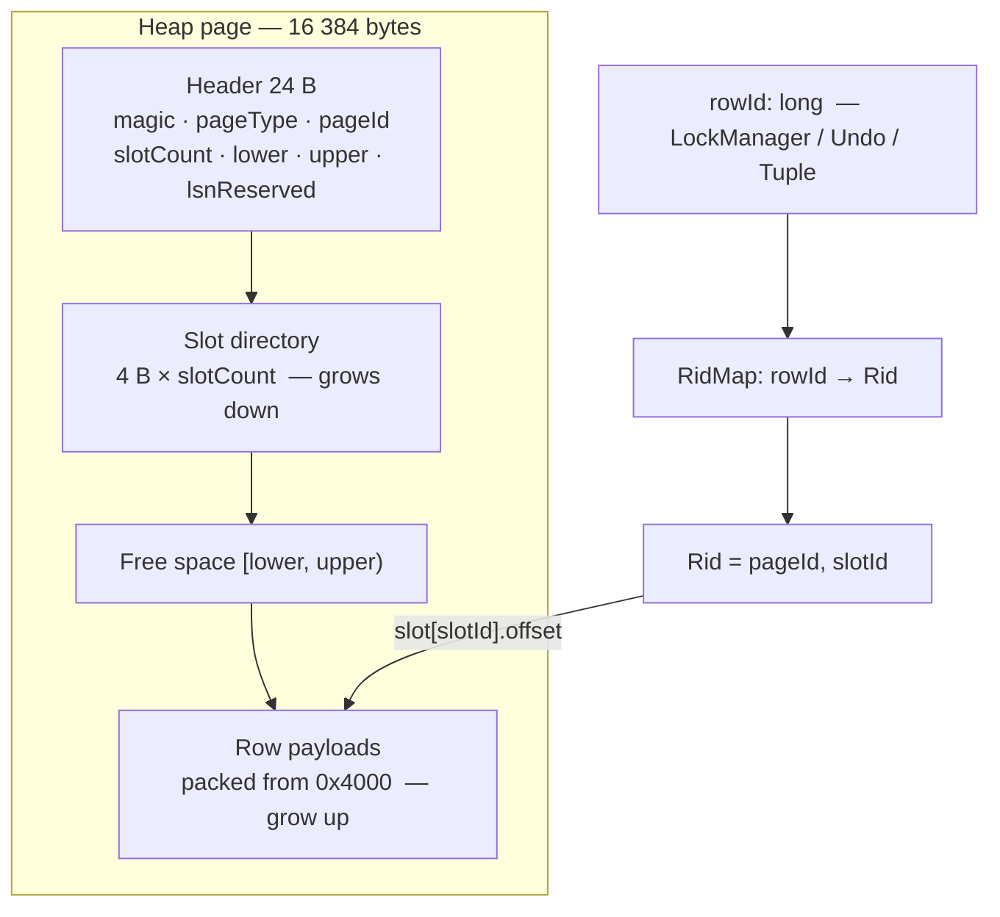

# Page, BufferPool, B+ tree & disk flush — build plan

**Path:** Page layout → BufferPool (+ flush) → File heap → B+ tree → DML WAL  
(Do not start with in-memory B+ tree and retrofit disk later — that rewrites I/O twice.)

Related: `docs/temp-dev-notes/BufferPool.md`, `docs/product/README.md`,  
`docs/temp-dev-notes/Ideal-BTree-index-capabilities.md` (range / merge / UNIQUE beyond Phase 5 equality)

---

## Done — Phase 1 (READ COMMITTED + Strict 2PL)

- Volcano executor + WHERE on `InMemoryTableStore`
- Row/table locks (IS/IX/S/X) in Volcano + DDL locks in `CommandExecutor`
- Explicit `BEGIN` / `COMMIT` / `ROLLBACK`
- **READ COMMITTED:** release **S** + table **IS** at statement end; keep **X** / **IX** until COMMIT/ABORT
- **Strict 2PL on writes**; read-your-writes (X bypasses S on same row)
- `**UndoManager**` before-images; rollback newest-first (not full heap snapshot)
- Deadlock: wait-for graph + victim abort (`DETECT_RESOLVE`)
- Post-lock re-read (`findByRowId`) on `SeqScan` / `UpdateOperator` / `DeleteOperator`
- Tests: cascadeless read, non-repeatable read allowed, write-path lock-before-predicate, undo, deadlock

---

## Done — Phase 2 (Page layout)

- Fixed page size (16 KiB; small pages in tests)
- Header + **slot directory** + row bytes for `INT` / `VARCHAR` / `BOOLEAN`
- Define row address: keep internal `rowId`, map to `(pageId, slotId)` on heap pages
- Pure codecs / layout — no pool, no tree yet
- Types under `storage.page`: `HeapPage`, `RowCodec`, `Rid` / `RidMap`, `PageLayout` / `PageType`
- **Not wired** into `StorageEngine` / `TableStore` yet (Phase 4)
- Note: InnoDB solves “find the row” with a **clustered PK tree**, not a RidMap — see section below

```text
offset
0x0000  ┌─────────────────────────────────────────┐
        │ PAGE HEADER (24 B)                     │
        │   magic, pageType=HEAP, pageId          │
        │   slotCount, lower, upper, lsnReserved  │
0x0018  ├─────────────────────────────────────────┤
        │ slot[0]  offset:u16 | length:u16      │──► row 0
        │ slot[1]  offset:u16 | length:u16      │──► row 1
        │ slot[n]  …                             │
 lower  ├─────────────────────────────────────────┤  directory grows down
        │                                         │
        │              FREE SPACE                │
        │           [lower, upper)               │
        │                                         │
 upper  ├─────────────────────────────────────────┤  rows grow up
        │ row n  packed INT/VARCHAR/BOOLEAN        │
        │ row 1                                   │
        │ row 0                                   │
0x4000  └─────────────────────────────────────────┘
        pageSize = 16 384;  disk offset = pageId × pageSize
```




Row payload (catalog column order): `rowId:u64` · null bitmap (`ceil(nCols/8)`) · `INT` as i32 · `VARCHAR` as u16 length + UTF-8 · `BOOLEAN` as u8. Null bit set → that type’s bytes are omitted. `rowId` stays the lock/undo key; `(pageId, slotId)` is only the heap address.

---

## Row identity — what InnoDB does (vs this project)

InnoDB does **not** keep a RAM `rowId → (page, slot)` map. Rows are found through the **clustered index**.


|                                    | **InnoDB**                                                                                   | **This project (Phases 4–5)**                                                                         |
| ---------------------------------- | -------------------------------------------------------------------------------------------- | ----------------------------------------------------------------------------------------------------- |
| Where rows live                    | Inside the **PRIMARY KEY B+ tree** (clustered). Leaf = full row.                             | Separate **heap** `.ibd` (slotted pages).                                                             |
| Row identity                       | PK columns (or hidden 6-byte `ROW_ID` if no PK / usable unique key).                         | Generated `rowId: long` (locks / undo / `Tuple`).                                                     |
| Find one row                       | Descend clustered tree by PK / `ROW_ID`.                                                     | `RidMap`: `rowId → Rid(pageId, slotId)` → pin heap page → slot.                                       |
| Secondary index leaf               | `**key → primary key values**` (not a page address).                                         | `**key → Rid**` into `.ibd` (Postgres-style TID).                                                     |
| Why secondary avoids physical RIDs | Row can move in the clustered tree; secondary still points at PK, then one clustered lookup. | Heap `Rid` can change on growing UPDATE (delete + re-insert); update RidMap (and later index leaves). |
| On-page offset                     | Page directory still exists — only after you already reached that page via the tree.         | Slot directory is the on-page address; RidMap (or index) chooses the page.                            |


```text
InnoDB:
  secondary key ──► PK values ──► clustered B+ leaf ──► row bytes

Us (heap + secondary):
  rowId ──RidMap──► Rid(page, slot) ──► heap bytes
  index key ──► Rid(page, slot) ──► heap bytes
```

**Why we still use RidMap:** locks and undo are keyed by `rowId`, and Phase 4 is a heap before any clustered PK exists. RidMap is the bridge until (optional, later) a true clustered PRIMARY KEY like InnoDB. Phase 5 keeps `key → Rid` on purpose — simpler with a heap; switching secondary leaves to `key → PK` only pays off once rows live in a clustered PK tree (Phase 7+ / explicitly later).

**RidMap durability (our choice):** RAM only (`InMemoryRidMap`). Not stored on a meta page (a full map can be huge). On open, scan the `.ibd`, read `rowId` from each live slot, rebuild `put(rowId, Rid)`. Source of truth = heap bytes; map = address cache. `nextRowId = max(rowId) + 1` from the same scan (no meta page in Phase 4).

---

## Files & page shape (heap vs index)

**Decision:** table **data** pages live in a `.ibd` heap file; each **index** is its own `.idx` B+ tree file. One shared BufferPool caches both. Catalog JSON and `wal.log` stay separate (not paged).

```text
data/shop/users/catalog.json     ← schema only (not in the pool)
data/shop/users/users.ibd        ← HEAP pages (TableStore / FileTableStore)
data/shop/users/name.idx         ← INDEX pages for CREATE INDEX … (name)  (IndexStore)
data/wal.log                     ← WAL append path (off the pool)
```

Page identity is `**(file, pageId)**` — page 0 in `users.ibd` is not page 0 in `name.idx`.

```text
users.ibd                    name.idx
┌──────────────────┐         ┌──────────────────┐
│ HEAP page 16 KiB │         │ INDEX page 16 KiB│
│ slots + row bytes│         │ keys + child/Rid │
└──────────────────┘         └──────────────────┘
          \                         /
           \                       /
            └── BufferPool (shared frames) ──┘
                 pin(file, pageId)
```


| Layer           | Same for heap & index? | Notes                                                                                                   |
| --------------- | ---------------------- | ------------------------------------------------------------------------------------------------------- |
| Block size      | **Yes**                | 16 KiB (smaller in tests) so one pool / one I/O size                                                    |
| Pool API        | **Yes**                | `pin(file, pageId)` → frame; latch S/X; dirty; flush                                                    |
| Outer header    | **Mostly**             | `magic`, `pageType`, `pageId`, reserved LSN — `pageType` picks the codec                                |
| Payload / codec | **No**                 | Heap = slotted rows (`HeapPage` / `RowCodec`). Index = leaf/internal keys + pointers (Phase 5 types)    |
| `Rid`           | Heap file only         | Leaf entry is usually `(key → Rid)`; `Rid.pageId` addresses a page **inside `.ibd`**, not inside `.idx` |


B+ tree–compatible means: **same container and pool**, not “reuse `HeapPage.insert` as a tree node.” Index pages get their own layout behind `PageType` (e.g. leaf / internal) while keeping the fixed page size.

`DROP TABLE` / `DROP INDEX` must delete the matching `.ibd` / `.idx` files (not only catalog JSON).

---

## Done — Phase 3 (BufferPool + flush)

- `BufferPool`: frames, pin/unpin, latch S/X, dirty bit, clock eviction
- Page key is `**(file, pageId)**`; I/O via `PhysicalStorage` (`offset = pageId * pageSize` within that file)
- `flush` / `flushAll` for eviction path (dirty only via flush), checkpoint hook, and `StorageEngine.stop`
- Phase 3 policy: **never evict dirty frames** (global no-steal until DML WAL)
- Wired in `StorageEngine` as `DefaultBufferPool`; Volcano never calls pin — only future `TableStore` / `IndexStore`
- Catalog JSON and `wal.log` stay **off** the pool; heap and index pages will share **one** pool
- Types: `PageId`, `BufferFrame`, `DefaultBufferPool`, `PhysicalStorage.byteLength`

Detail: `docs/temp-dev-notes/BufferPool.md`

---

## Done — Phase 4 (File heap `TableStore`)

- `FileTableStore` on `users.ibd` through BufferPool; `TableHeapFiles.ibdPath`
- RidMap / `nextRowId` in RAM; rebuilt on open by scanning live slots
- `CREATE TABLE` → `prepareTable` (empty `.ibd`); `DROP TABLE` drops `.ibd` before catalog dir
- Milestone: restart → `SELECT` still returns rows (`DmlRestartTest`)


| Topic                          | Choice                                                                                                              |
| ------------------------------ | ------------------------------------------------------------------------------------------------------------------- |
| File                           | One `.ibd` per table (`shop/users/users.ibd`); path helper `(db, table) → file`                                     |
| Meta page                      | **None** in Phase 4 — data pages start at page 0                                                                    |
| Schema on encode/decode        | `ColumnType[]` from `CatalogManager`                                                                                |
| Insert space                   | Append: use last page until it cannot fit the new row, then `BufferPool.newPage`                                    |
| Growing UPDATE                 | If new payload > old slot length: tombstone old slot, insert elsewhere, **update RidMap** (same `rowId`, new `Rid`) |
| RidMap / `nextRowId`           | RAM map; **rebuild both on open** by scanning live slots (`nextRowId = max + 1`)                                    |
| Wiring                         | `FileTableStore` under `UndoableTableStore` in `DefaultStorageEngine`; Volcano unchanged                            |
| Latch protocol                 | pin → latch → mutate → markDirty → unlatch → unpin; never hold latch until COMMIT                                   |
| `snapshot` / `restoreSnapshot` | Unused by txn rollback (undo path); no-op or test-only                                                              |
| ALTER ADD COLUMN               | **Null-pad** missing columns when decoding older narrower rows                                                      |


**Work:**

- Page-backed heap through BufferPool (replace `InMemoryTableStore`)
- `insert` / `scan` / `update` / `delete` / `findByRowId` via pin → latch → slot → unpin
- Keep existing row locks + undo + post-lock re-read (`rowId` unchanged when a row relocates)
- `CREATE TABLE` creates empty `.ibd` (or first insert); `DROP TABLE` / `DROP DATABASE` deletes `.ibd` (and later `.idx`), not only catalog JSON
- Milestone: restart server → `SELECT` still returns rows (dirty pages flushed on stop / later checkpoint)

---

## Done — Phase 5 (B+ tree `IndexStore`)

- One `{indexName}.idx` per catalog index; page 0 = `INDEX_META` (root + height)
- `FileIndexStore`: insert/search/split/delete; crabbing latches via `withExclusive` / `withShared`
- `CREATE INDEX` → catalog + `IndexBuilder.bulkBuild` from heap; `DROP INDEX` / `DROP TABLE` delete `.idx`
- `IndexMaintainer` on DML; index undo records in `UndoManager` for explicit `ROLLBACK`
- `IndexScanOperator` + `VolcanoExecutor` honor `AccessPath.INDEX_SCAN`
- Index page types: `INDEX_META`, `INDEX_LEAF`, `INDEX_LEAF` sibling link; `INDEX_INTERNAL` separators
- `IndexKeyCodec` composite keys; leaf `key → Rid`, internal `key → childPageId`

---

## Done — Phase 6 (DML WAL + WAL-before-data)

- Logical `INSERT_ROW` / `UPDATE_ROW` / `DELETE_ROW` / `INDEX_*` in `wal.log`
- Heap page LSN at `PageLayout.OFF_LSN_RESERVED`; `flushUpTo` before `.ibd` write
- `COMMIT` flushes WAL only (no-force pages); recovery redoes committed DML
- `CHECKPOINT` under ENGINE X: flush WAL → `bufferPool.flushAll` → fence
- Keep no-steal; keep `IndexPageWal` for `.idx` images

---

## Done — Phase 7 (PRIMARY KEY + internal B+ tree merge/borrow + best-index planner heuristic)

Stay on **READ COMMITTED** (no RR / gap locks this phase).

- **PRIMARY KEY** — DDL (`PRIMARY KEY` on create table or equivalent); unique + NOT NULL on those columns; enforce on DML and index build (heap + secondary `.idx` model, not clustered yet)
- **Index delete: finish internal merge/underflow** — leaf borrow/merge already existed; internal-node borrow/merge now cascades via `rebalanceInternalAfterDelete`; root height shrink remains correct
- **Planner: choose best index** — when several indexes match the `WHERE` (leading-column equality/range), pick the preferred one instead of catalog order / first-match; simple teaching heuristic is enough (e.g. prefer UNIQUE/PK, prefer equality over range, prefer more selective leading column / narrower key — no full cost model required)
- LLD + integration tests in sync (delete-heavy trees, PK uniqueness / null reject, multi-index plan choice)

---

## Explicitly later

- **Steal** — allow dirty clock eviction once WAL-before-data is trusted under load
- **REPEATABLE READ** — hold S locks until COMMIT
- Phantom / gap / next-key locks
- Full composite equality prefixes (`a = ? AND b = ?` as multi-column probe)
- Eager `QueryDispatcher`
- Graceful TCP shutdown
- Performance analysis
- **InnoDB-style clustered PRIMARY KEY** (rows in PK tree; secondary leaf = `key → PK`; RidMap optional / gone for PK lookups)
- Heap meta page 0 only if open-scan of `nextRowId` / free-list becomes painful (never put full RidMap on meta)
- Merge `index-wal.log` into `wal.log`

---

## Rules of thumb


| Layer                         | Owns                                               | Hold until                         |
| ----------------------------- | -------------------------------------------------- | ---------------------------------- |
| **Row locks** (`LockManager`) | SQL / txn concurrency                              | statement (S) or COMMIT (X)        |
| **Page latches** (BufferPool) | heap/tree bytes in a frame                         | microseconds — never until COMMIT  |
| **BufferPool**                | RAM frames ↔ disk pages in **any** `.ibd` / `.idx` | pin while using frame              |
| **WAL**                       | durable change log                                 | flush before dirty data page write |


**Files:** `.ibd` = heap rows; `.idx` = one B+ tree each; same page size + one pool; `pageType` (and file) choose the codec.  
**Addresses:** InnoDB = clustered PK (+ secondary → PK). Us = heap + `RidMap` / index → Rid.

**Build order one-liner:** Page layout → BufferPool (+ flush) → File heap (`.ibd`) → B+ tree (`.idx`) → DML WAL.