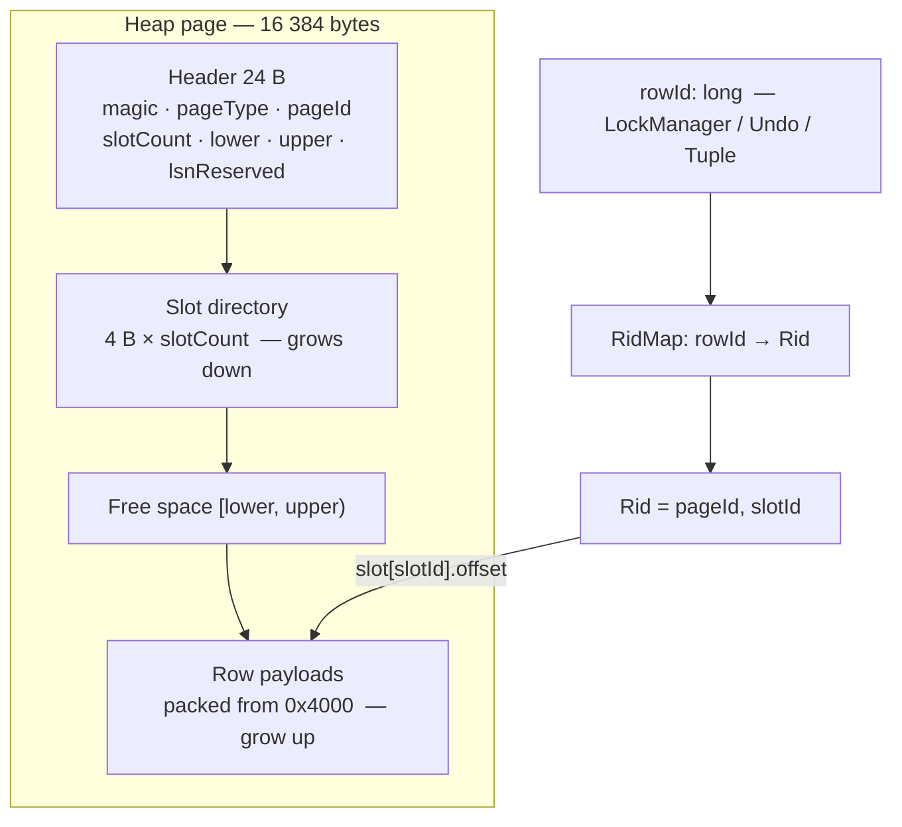

# Page, BufferPool, B+ tree & disk flush — build plan

**Path:** Page layout → BufferPool (+ flush) → File heap → B+ tree → DML WAL  
(Do not start with in-memory B+ tree and retrofit disk later — that rewrites I/O twice.)

Related: `docs/temp-dev-notes/BufferPool.md`, `docs/product/README.md`

---

## Done — Phase 1 (READ COMMITTED + Strict 2PL)

- Volcano executor + WHERE on `InMemoryTableStore`
- Row/table locks (IS/IX/S/X) in Volcano + DDL locks in `CommandExecutor`
- Explicit `BEGIN` / `COMMIT` / `ROLLBACK`
- **READ COMMITTED:** release **S** + table **IS** at statement end; keep **X** / **IX** until COMMIT/ABORT
- **Strict 2PL on writes**; read-your-writes (X bypasses S on same row)
- **`UndoManager`** before-images; rollback newest-first (not full heap snapshot)
- Deadlock: wait-for graph + victim abort (`DETECT_RESOLVE`)
- Post-lock re-read (`findByRowId`) on `SeqScan` / `UpdateOperator` / `DeleteOperator`
- Tests: cascadeless read, non-repeatable read allowed, write-path lock-before-predicate, undo, deadlock

---

## Done — Phase 2 (Page layout)

- Fixed page size (16 KiB; small pages in tests)
- Header + **slot directory** + row bytes for `INT` / `VARCHAR` / `BOOLEAN`
- Define row address: keep internal `rowId`, map to `(pageId, slotId)` on heap pages
- Pure codecs / layout — no pool, no tree yet
- Types under `storage.page`: `HeapPage`, `RowCodec`, `Rid` / `RidMap`, `PageLayout` / `PageType`
- **Not wired** into `StorageEngine` / `TableStore` yet (Phase 4)

```text
offset
0x0000  ┌─────────────────────────────────────────┐
        │ PAGE HEADER (24 B)                     │
        │   magic, pageType=HEAP, pageId          │
        │   slotCount, lower, upper, lsnReserved  │
0x0018  ├─────────────────────────────────────────┤
        │ slot[0]  offset:u16 | length:u16      │──► row 0
        │ slot[1]  offset:u16 | length:u16      │──► row 1
        │ slot[n]  …                             │
 lower  ├─────────────────────────────────────────┤  directory grows down
        │                                         │
        │              FREE SPACE                │
        │           [lower, upper)               │
        │                                         │
 upper  ├─────────────────────────────────────────┤  rows grow up
        │ row n  packed INT/VARCHAR/BOOLEAN        │
        │ row 1                                   │
        │ row 0                                   │
0x4000  └─────────────────────────────────────────┘
        pageSize = 16 384;  disk offset = pageId × pageSize
```



Row payload (catalog column order): `rowId:u64` · null bitmap (`ceil(nCols/8)`) · `INT` as i32 · `VARCHAR` as u16 length + UTF-8 · `BOOLEAN` as u8. Null bit set → that type’s bytes are omitted. `rowId` stays the lock/undo key; `(pageId, slotId)` is only the heap address.

---

## Files & page shape (heap vs index)

**Decision:** table **data** pages live in a `.ibd` heap file; each **index** is its own `.idx` B+ tree file. One shared BufferPool caches both. Catalog JSON and `wal.log` stay separate (not paged).

```text
data/shop/users/catalog.json     ← schema only (not in the pool)
data/shop/users/users.ibd        ← HEAP pages (TableStore / FileTableStore)
data/shop/users/name.idx         ← INDEX pages for CREATE INDEX … (name)  (IndexStore)
data/wal.log                     ← WAL append path (off the pool)
```

Page identity is **`(file, pageId)`** — page 0 in `users.ibd` is not page 0 in `name.idx`.

```text
users.ibd                    name.idx
┌──────────────────┐         ┌──────────────────┐
│ HEAP page 16 KiB │         │ INDEX page 16 KiB│
│ slots + row bytes│         │ keys + child/Rid │
└──────────────────┘         └──────────────────┘
          \                         /
           \                       /
            └── BufferPool (shared frames) ──┘
                 pin(file, pageId)
```

| Layer | Same for heap & index? | Notes |
|-------|------------------------|--------|
| Block size | **Yes** | 16 KiB (smaller in tests) so one pool / one I/O size |
| Pool API | **Yes** | `pin(file, pageId)` → frame; latch S/X; dirty; flush |
| Outer header | **Mostly** | `magic`, `pageType`, `pageId`, reserved LSN — `pageType` picks the codec |
| Payload / codec | **No** | Heap = slotted rows (`HeapPage` / `RowCodec`). Index = leaf/internal keys + pointers (Phase 5 types) |
| `Rid` | Heap file only | Leaf entry is usually `(key → Rid)`; `Rid.pageId` addresses a page **inside `.ibd`**, not inside `.idx` |

B+ tree–compatible means: **same container and pool**, not “reuse `HeapPage.insert` as a tree node.” Index pages get their own layout behind `PageType` (e.g. leaf / internal) while keeping the fixed page size.

`DROP TABLE` / `DROP INDEX` must delete the matching `.ibd` / `.idx` files (not only catalog JSON).

---

## Done — Phase 3 (BufferPool + flush)

- `BufferPool`: frames, pin/unpin, latch S/X, dirty bit, clock eviction
- Page key is **`(file, pageId)`**; I/O via `PhysicalStorage` (`offset = pageId * pageSize` within that file)
- `flush` / `flushAll` for eviction path (dirty only via flush), checkpoint hook, and `StorageEngine.stop`
- Phase 3 policy: **never evict dirty frames** (global no-steal until DML WAL)
- Wired in `StorageEngine` as `DefaultBufferPool`; Volcano never calls pin — only future `TableStore` / `IndexStore`
- Catalog JSON and `wal.log` stay **off** the pool; heap and index pages will share **one** pool
- Types: `PageId`, `BufferFrame`, `DefaultBufferPool`, `PhysicalStorage.byteLength`
- **DML still `InMemoryTableStore`** — restart still loses rows until Phase 4

Detail: `docs/temp-dev-notes/BufferPool.md`

---

## Phase 4 — File heap `TableStore`

- Page-backed heap through BufferPool (replace or wrap `InMemoryTableStore`)
- Persist rows in **`users.ibd`** (per-table heap file under the table directory)
- `insert` / `scan` / `update` / `delete` / `findByRowId` via pin → latch → slot → unpin
- Durable `rowId → Rid` (Rid points into that `.ibd`); keep existing row locks + undo + post-lock re-read
- Milestone: restart server → `SELECT` still returns rows (dirty pages flushed on stop/checkpoint)
- `DROP TABLE` deletes **`.ibd`** (and later `.idx`) files, not only catalog JSON

---

## Phase 5 — B+ tree `IndexStore` (same pool)

- One **`.idx` file per index** (e.g. `name.idx`); nodes are 16 KiB pages in that file, **not** mixed into `.ibd`
- Leaf / internal layout on the **same page size / pool / header contract** — different payload than heap rows
- Leaf stores **key → Rid** (Rid addresses `.ibd`); internal stores **key → child pageId** (pageId in this `.idx`)
- Search, insert, split, leaf-chain range scan
- Latch **crabbing** (parent → child → unlatch parent)
- Flesh out `IndexStore`; wire `CREATE INDEX` + `IndexScanOperator` + planner `INDEX_SCAN`
- Maintain indexes on INSERT / UPDATE (indexed cols) / DELETE
- Index undo records (with heap undo) for explicit txn rollback
- `DROP INDEX` deletes the `.idx` file; `DROP TABLE` deletes heap + all index files

---

## Phase 6 — DML WAL + WAL-before-data

- Log insert/update/delete (or page redo) **before** a dirty page may hit disk
- Eviction: flush WAL up to page LSN → write page → flush file
- `COMMIT`: flush WAL only (**no-force** pages); recovery redoes
- Extend `CHECKPOINT` to flush dirty pages after WAL
- Integrate with existing `UndoManager` for crash undo/redo

---

## Phase 7 — Hardening

- **PRIMARY KEY** / unique index enforcement
- **REPEATABLE READ:** hold **S** locks until COMMIT (isolation flag)
- Index delete: merge/underflow (if deferred)
- Phantom/gap locks (optional)
- LLD + integration tests kept in sync with each phase

---

## Explicitly later

- Eager `QueryDispatcher`
- Graceful TCP shutdown
- Performance analysis

---

## Rules of thumb

| Layer | Owns | Hold until |
|-------|------|------------|
| **Row locks** (`LockManager`) | SQL / txn concurrency | statement (S) or COMMIT (X) |
| **Page latches** (BufferPool) | heap/tree bytes in a frame | microseconds — never until COMMIT |
| **BufferPool** | RAM frames ↔ disk pages in **any** `.ibd` / `.idx` | pin while using frame |
| **WAL** | durable change log | flush before dirty data page write |

**Files:** `.ibd` = heap rows; `.idx` = one B+ tree each; same page size + one pool; `pageType` (and file) choose the codec.

**Build order one-liner:** Page layout → BufferPool (+ flush) → File heap (`.ibd`) → B+ tree (`.idx`) → DML WAL.
